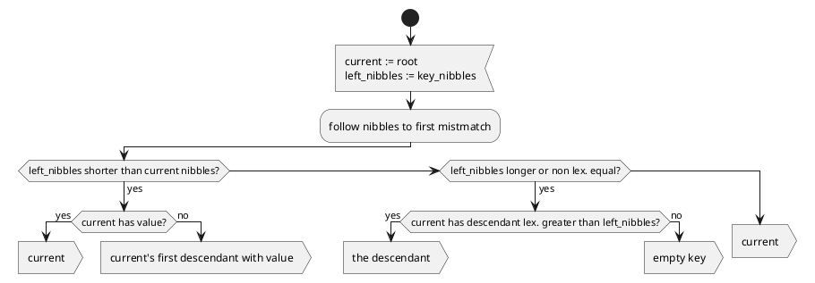

## Polkadot Trie Cursor

### Lower bound

```plantuml
@startuml lower bound algorithm
start
:current := root
left_nibbles := key_nibbles<

:follow nibbles to first mistmatch;

if (left_nibbles shorter than current nibbles?) then (yes)
    if (current has value?) then (yes)
        :current>
    else (no)
        :current's first descendant with value>
    endif
elseif (left_nibbles longer or non lex. equal?) then (yes)
    if (current has descendant lex. greater than left_nibbles?) then (yes)
        :the descendant>
    else (no)
        :empty key>
    endif
    detach
else
    :current>
endif
detach
@enduml
```
