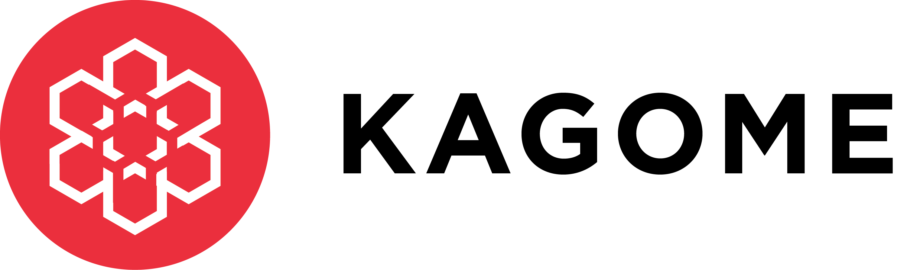

*******************************
Kagome documentation
*******************************

Kagome is a C++ implementation of `Polkadot Host <https://github.com/w3f/polkadot-spec/tree/master/runtime-environment-spec>`_ developed by `Soramitsu <https://soramitsu.co.jp/>`_ and funded by Web3 Foundation `grant <https://github.com/w3f/Web3-collaboration/blob/master/grants/grants.md>`_.

**WARNING:** Kagome is early-stage software. While we are doing our best to be compatible with other Polkadot Host implementations, we cannot guarantee full compatibility due to specification being in development.

This documentation will guide you through the installation, deployment, and launch of Kagome network, and explain to you how to write an application for it.

If you would like to understand how different components of Kagome are implemented you are welcome to review `documentation generated from the source code <https://kagome.netlify.app/>`_.

.. toctree::
    :maxdepth: 2
    :numbered:
    :caption: Table of contents

    development/README.md
    overview/getting_started.md
    tutorials/first_kagome_chain.md
    tutorials/private_network.md

Kagome in media
^^^^^^^^^^^^^^^
* Press-release: `Soramitsu to implement Polkadot Runtime Environment in C++ <https://medium.com/web3foundation/w3f-grants-soramitsu-to-implement-polkadot-runtime-environment-in-c-cf3baa08cbe6>`_
* `Kagome: C++ implementation of PRE <https://www.youtube.com/watch?v=181mk2xvBZ4&t=>`_ presentation at DOTCon (18.08.19)
* `Kagome and consensus in Polkadot <https://www.youtube.com/watch?v=5OrevTjaiPA>`_ presentation (in Russian) during Innopolis blockchain meetup (28.10.19)
